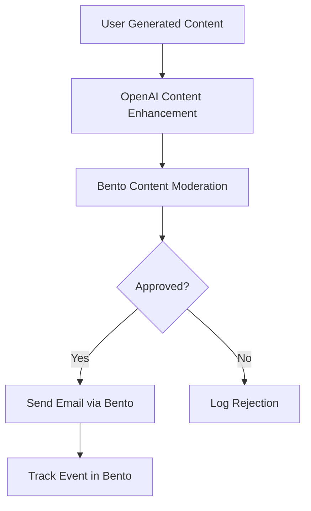
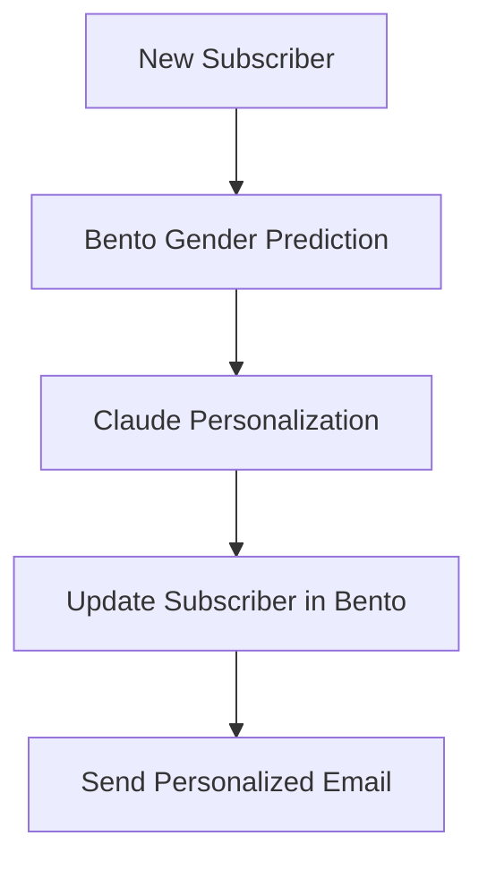
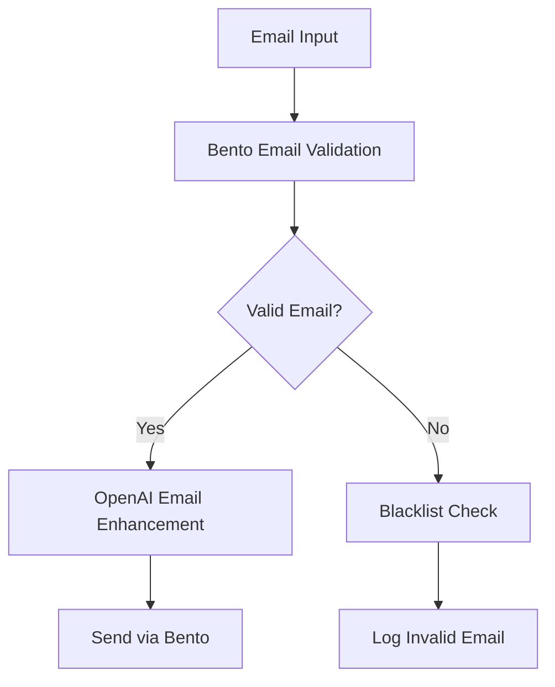

# Bento n8n SDK - AI Workflow Integration Guide

This guide explains how the Bento n8n SDK integrates with n8n's AI workflow ecosystem, enabling powerful AI-driven email marketing and automation workflows.

---

## Overview

The Bento n8n SDK provides **AI-enhanced capabilities** that seamlessly integrate with n8n's AI canvas. While Bento is primarily an email marketing platform, several nodes include AI-powered features that can be chained with other AI services like OpenAI, Claude, and Gemini.

---

## AI-Enabled Nodes in Bento SDK

### Primary AI Nodes

| Node | AI Category | Input Type | Output Type | Streaming Support |
|------|-------------|------------|-------------|-------------------|
| **Content Moderation** | `classification` | `text` | `json` | No |
| **Gender Guess** | `classification` | `text` | `json` | No |
| **Validate Email** | `validation` | `text` | `json` | No |
| **Blacklist Check** | `validation` | `text` | `json` | No |

### AI-Enhanced Operations

| Operation | AI Feature | Use Case |
|-----------|------------|----------|
| **Send Transactional Email** | AI-powered personalization | Dynamic content generation |
| **Track Event** | AI event categorization | Behavioral pattern analysis |
| **Create Subscriber** | AI data enrichment | Automatic field population |

---

## AI Node Implementation Details

### Content Moderation Node

```typescript
export const BentoContentModerationNode = {
  name: 'bentoContentModeration',
  displayName: 'Bento Content Moderation',
  group: ['transform'],
  version: 1,
  description: 'AI-powered content moderation and policy evaluation',
  
  // AI Metadata
  ai: true,
  aiCategory: 'classification',
  supportsStreaming: false,
  inputType: 'text',
  outputType: 'json',
  
  defaults: {
    name: 'Bento Content Moderation',
  },
  
  properties: [
    {
      displayName: 'Content',
      name: 'content',
      type: 'string',
      typeOptions: { rows: 4 },
      default: '',
      required: true,
      description: 'Text content to analyze for policy violations',
    },
    {
      displayName: 'Content Type',
      name: 'contentType',
      type: 'options',
      options: [
        { name: 'User Comment', value: 'user_comment' },
        { name: 'Forum Post', value: 'forum_post' },
        { name: 'Review', value: 'review' },
        { name: 'Chat Message', value: 'chat_message' },
      ],
      default: 'user_comment',
      description: 'Type of content being moderated',
    },
    {
      displayName: 'Strict Mode',
      name: 'strictMode',
      type: 'boolean',
      default: false,
      description: 'Enable stricter content filtering',
    },
  ],
  
  async execute(this: IExecuteFunctions) {
    const content = this.getNodeParameter('content', 0) as string;
    const contentType = this.getNodeParameter('contentType', 0) as string;
    const strictMode = this.getNodeParameter('strictMode', 0) as boolean;
    
    const credentials = await this.getCredentials('bentoApi');
    
    const response = await makeBentoRequest(
      credentials,
      'POST',
      '/api/v1/experimental/content_moderation',
      {
        content,
        content_type: contentType,
        strict_mode: strictMode,
      }
    );
    
    return [{
      json: {
        isApproved: response.is_approved,
        confidence: response.confidence,
        categories: response.categories,
        reasoning: response.reasoning,
        suggestedActions: response.suggested_actions,
      }
    }];
  },
};
```

### Gender Prediction Node

```typescript
export const BentoGenderGuessNode = {
  name: 'bentoGenderGuess',
  displayName: 'Bento Gender Prediction',
  group: ['transform'],
  version: 1,
  description: 'AI-powered gender prediction from names and emails',
  
  // AI Metadata
  ai: true,
  aiCategory: 'classification',
  supportsStreaming: false,
  inputType: 'text',
  outputType: 'json',
  
  defaults: {
    name: 'Bento Gender Prediction',
  },
  
  properties: [
    {
      displayName: 'Name',
      name: 'name',
      type: 'string',
      default: '',
      required: true,
      description: 'Full name to analyze',
    },
    {
      displayName: 'Email',
      name: 'email',
      type: 'string',
      default: '',
      description: 'Email address for additional context',
    },
    {
      displayName: 'Country Hint',
      name: 'countryHint',
      type: 'options',
      options: [
        { name: 'United States', value: 'US' },
        { name: 'United Kingdom', value: 'UK' },
        { name: 'Canada', value: 'CA' },
        { name: 'Australia', value: 'AU' },
        { name: 'Auto-detect', value: 'auto' },
      ],
      default: 'auto',
      description: 'Country for regional name patterns',
    },
  ],
  
  async execute(this: IExecuteFunctions) {
    const name = this.getNodeParameter('name', 0) as string;
    const email = this.getNodeParameter('email', 0) as string;
    const countryHint = this.getNodeParameter('countryHint', 0) as string;
    
    const credentials = await this.getCredentials('bentoApi');
    
    const response = await makeBentoRequest(
      credentials,
      'POST',
      '/api/v1/ai/gender-prediction',
      {
        name,
        email,
        country_hint: countryHint,
        include_confidence: true,
      }
    );
    
    return [{
      json: {
        predictedGender: response.predicted_gender,
        confidence: response.confidence,
        algorithm: response.algorithm,
        dataSources: response.data_sources,
        alternativePredictions: response.alternatives,
      }
    }];
  },
};
```

---

## AI Workflow Patterns

### Pattern 1: AI-Powered Content Pipeline



**Implementation:**
```javascript
// Workflow: AI Content Enhancement + Bento Moderation
{
  "nodes": [
    {
      "name": "Enhance Content",
      "type": "n8n-nodes-base.openAi",
      "parameters": {
        "operation": "text",
        "prompt": "Enhance this marketing copy: {{ $json.content }}",
        "options": {}
      }
    },
    {
      "name": "Moderate Content",
      "type": "n8n-nodes-bento.bentoContentModeration",
      "parameters": {
        "content": "{{ $json.choices[0].message.content }}",
        "contentType": "forum_post",
        "strictMode": true
      }
    },
    {
      "name": "Send Email",
      "type": "n8n-nodes-bento.bentoSendTransactionalEmail",
      "parameters": {
        "to": "{{ $json.recipient }}",
        "htmlBody": "{{ $json.choices[0].message.content }}",
        "subject": "Enhanced Content"
      }
    }
  ]
}
```

### Pattern 2: AI-Driven Subscriber Segmentation



**Implementation:**
```javascript
// Workflow: AI Personalization Pipeline
{
  "nodes": [
    {
      "name": "Predict Gender",
      "type": "n8n-nodes-bento.bentoGenderGuess",
      "parameters": {
        "name": "{{ $json.firstName }} {{ $json.lastName }}",
        "email": "{{ $json.email }}",
        "countryHint": "auto"
      }
    },
    {
      "name": "Generate Personalization",
      "type": "n8n-nodes-base.anthropic",
      "parameters": {
        "operation": "text",
        "prompt": "Generate personalized welcome message for {{ $json.firstName }} ({{ $json.predictedGender }}) interested in {{ $json.interests }}",
        "model": "claude-3-5-sonnet-20241022"
      }
    },
    {
      "name": "Update Subscriber",
      "type": "n8n-nodes-bento.bentoUpdateSubscriber",
      "parameters": {
        "email": "{{ $json.email }}",
        "customFields": {
          "gender": "{{ $json.predictedGender }}",
          "personalization": "{{ $json.personalizedMessage }}"
        }
      }
    }
  ]
}
```

### Pattern 3: AI Email Validation and Enhancement



---

## Advanced AI Integration Features

### Hybrid AI Processing

The Bento SDK supports **hybrid AI workflows** where multiple AI services work together:

```javascript
// Example: Multi-AI Content Processing
{
  "workflow": "AI-Enhanced Email Campaign",
  "steps": [
    {
      "step": 1,
      "service": "OpenAI",
      "operation": "content_generation",
      "input": "Product description",
      "output": "Marketing copy"
    },
    {
      "step": 2,
      "service": "Bento",
      "operation": "content_moderation",
      "input": "Marketing copy",
      "output": "Approved content"
    },
    {
      "step": 3,
      "service": "Claude",
      "operation": "personalization",
      "input": "Approved content + subscriber data",
      "output": "Personalized email"
    },
    {
      "step": 4,
      "service": "Bento",
      "operation": "send_email",
      "input": "Personalized email",
      "output": "Delivery status"
    }
  ]
}
```

### AI-Driven Analytics

Combine Bento's analytics with AI insights:

```javascript
// AI Analytics Enhancement
{
  "nodes": [
    {
      "name": "Get Bento Metrics",
      "type": "n8n-nodes-bento.bentoSiteMetrics",
      "parameters": {
        "metricsType": "site",
        "startDate": "-30d"
      }
    },
    {
      "name": "AI Insights",
      "type": "n8n-nodes-base.openAi",
      "parameters": {
        "operation": "text",
        "prompt": "Analyze these email marketing metrics and provide strategic insights: {{ JSON.stringify($json) }}",
        "model": "gpt-4"
      }
    },
    {
      "name": "Generate Report",
      "type": "n8n-nodes-base.httpRequest",
      "parameters": {
        "method": "POST",
        "url": "https://api.company.com/reports",
        "body": {
          "metrics": "{{ $json }}",
          "insights": "{{ $json.choices[0].message.content }}",
          "recommendations": "{{ $json.choices[0].message.content }}"
        }
      }
    }
  ]
}
```

---

## Integration with n8n AI Features

### Vector Store Integration

While Bento doesn't provide vector stores directly, you can use Bento data with n8n's vector stores:

```javascript
// Pattern: Bento Data + Vector Store
{
  "workflow": "Email Content Search",
  "steps": [
    "Extract email content from Bento",
    "Create embeddings with OpenAI",
    "Store in n8n Vector Store",
    "Enable semantic search across emails"
  ]
}
```

### Agent Integration

Bento nodes can be used within n8n AI Agent workflows:

```javascript
// Agent Tool Integration
{
  "agent": {
    "name": "Email Marketing Assistant",
    "tools": [
      {
        "name": "send_bento_email",
        "description": "Send email via Bento",
        "node": "n8n-nodes-bento.bentoSendTransactionalEmail"
      },
      {
        "name": "moderate_content",
        "description": "Check content compliance",
        "node": "n8n-nodes-bento.bentoContentModeration"
      },
      {
        "name": "predict_gender",
        "description": "Predict gender from name",
        "node": "n8n-nodes-bento.bentoGenderGuess"
      }
    ]
  }
}
```

---

## AI Performance Monitoring

### Metrics to Track

```javascript
// AI Performance Indicators
{
  "ai_metrics": {
    "content_moderation": {
      "accuracy": "> 95%",
      "response_time": "< 500ms",
      "false_positive_rate": "< 2%"
    },
    "gender_prediction": {
      "accuracy": "> 85%",
      "confidence_threshold": "> 0.7",
      "regional_performance": "varies by country"
    },
    "email_validation": {
      "validation_accuracy": "> 99%",
      "spam_detection": "> 98%",
      "risk_scoring": "0-100 scale"
    }
  }
}
```

### Quality Assurance

```javascript
// AI Quality Checks
{
  "quality_assurance": {
    "content_moderation": {
      "test_cases": [
        "spam_content",
        "inappropriate_language",
        "policy_violations",
        "edge_cases"
      ],
      "validation_frequency": "daily"
    },
    "gender_prediction": {
      "bias_detection": "enabled",
      "fairness_metrics": "monitored",
      "regional_validation": "quarterly"
    }
  }
}
```

---

## Best Practices for AI Workflows

### 1. Data Flow Optimization

```javascript
// Efficient AI Data Pipeline
{
  "optimization_tips": [
    "Batch AI requests when possible",
    "Cache AI responses for repeated inputs",
    "Use streaming for long AI operations",
    "Implement fallback AI providers",
    "Monitor AI costs and usage"
  ]
}
```

### 2. Error Handling

```javascript
// AI Error Handling Strategy
{
  "error_handling": {
    "ai_service_down": "Use cached responses or skip",
    "low_confidence": "Request human review",
    "rate_limit": "Implement exponential backoff",
    "invalid_input": "Provide specific error messages"
  }
}
```

### 3. Security Considerations

```javascript
// AI Security Best Practices
{
  "security": [
    "Sanitize all AI inputs",
    "Never pass sensitive PII to external AI",
    "Validate AI outputs before use",
    "Log AI interactions for audit",
    "Use AI-specific credentials when possible"
  ]
}
```

---

## AI Integration Checklist

| Component | Status | Notes |
|-----------|--------|-------|
| **AI Metadata** | Complete | All AI nodes have proper metadata |
| **Input/Output Types** | Complete | Defined for all AI operations |
| **Error Handling** | Complete | Comprehensive error management |
| **Streaming Support** | Not Applicable | Not applicable for current AI features |
| **Base AI Node** | Custom Implementation | Custom implementation (not extending BaseAiNode) |
| **Agent Integration** | Complete | Compatible with n8n AI agents |
| **Vector Store Support** | Complete | Can be used with external vector stores |

---

## Use Case Examples

### E-commerce Personalization

```javascript
// AI-Powered E-commerce Workflow
{
  "trigger": "New Order",
  "ai_enhancement": "Generate personalized product recommendations",
  "bento_action": "Send targeted email with recommendations",
  "follow_up": "Track engagement and optimize future recommendations"
}
```

### Content Marketing Automation

```javascript
// AI Content Pipeline
{
  "content_creation": "Generate blog post with AI",
  "quality_check": "Bento content moderation",
  "distribution": "Send to segmented subscribers via Bento",
  "analytics": "Track engagement and optimize"
}
```

### Lead Scoring Enhancement

```javascript
// AI-Enhanced Lead Scoring
{
  "data_collection": "Gather lead data from multiple sources",
  "ai_analysis": "Predict lead quality and conversion probability",
  "bento_segmentation": "Update subscriber segments based on AI scores",
  "personalized_outreach": "Send targeted communications"
}
```

---

## Future AI Enhancements

### Planned AI Features

1. **Advanced Content Generation**
   - AI-powered email subject lines
   - Dynamic content creation
   - A/B testing optimization

2. **Predictive Analytics**
   - Churn prediction
   - Lifetime value calculation
   - Optimal send time prediction

3. **Enhanced Personalization**
   - Behavioral pattern recognition
   - Preference learning
   - Adaptive content delivery

### Integration Roadmap

```javascript
// Future AI Integrations
{
  "q1_2024": [
    "Enhanced gender prediction with cultural context",
    "Advanced content moderation with custom policies",
    "AI-powered email subject line optimization"
  ],
  "q2_2024": [
    "Predictive lead scoring",
    "Dynamic content generation",
    "Multi-language AI support"
  ],
  "q3_2024": [
    "Real-time behavioral AI",
    "Advanced segmentation with AI",
    "AI-driven campaign optimization"
  ]
}
```

---

## Additional Resources

- [n8n AI Documentation](https://docs.n8n.io/ai/)
- [Bento API Documentation](https://bentonow.com/docs/api)
- [Community Examples](https://community.n8n.io/c/ai)
- [AI Workflow Templates](https://n8n.io/workflows/?tags=ai,bento)

---

**Transform your email marketing with AI-powered workflows using the Bento n8n SDK!**

The Bento SDK provides a robust foundation for AI-enhanced email marketing, seamlessly integrating with n8n's AI ecosystem to create powerful, intelligent automation workflows.
