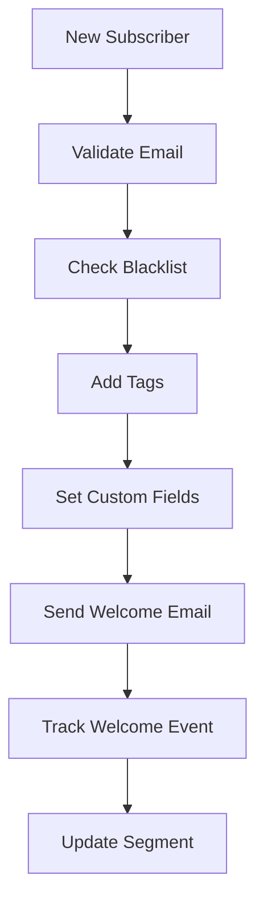

# Bento n8n SDK - Power User Guide

This guide covers advanced features, optimization techniques, and expert-level workflows for experienced n8n users working with the Bento SDK.

## Advanced Configuration

### Request Optimization

The SDK includes sophisticated request management:

```javascript
// Automatic retry configuration (built-in)
{
  retries: 3,
  backoffMultiplier: 2,
  baseDelay: 1000,
  maxConcurrentRequests: 5
}

// Custom timeout handling
{
  timeout: 30000, // 30 seconds default
  retryOnCodes: [408, 429, 500, 502, 503, 504]
}
```

### Pipeline Pattern Implementation

Complex operations use a pipeline architecture:

```javascript
// Example: Blacklist Check Pipeline
1. Input Validation → 2. Payload Building → 3. API Request → 4. Response Processing
```

**Pipeline Benefits:**
- Consistent error handling
- Input sanitization
- Response transformation
- Audit logging

## Advanced Node Operations

### Subscriber Command Matrix

The Subscriber Command node supports 8 distinct operations:

| Command | Use Case | Parameters | Side Effects |
|---------|----------|------------|--------------|
| `add_tags` | Segment enrichment | `tags: ["tag1", "tag2"]` | Updates subscriber tags |
| `remove_tags` | List cleaning | `tags: ["tag1"]` | Removes specified tags |
| `add_custom_fields` | Data enrichment | `fields: {key: "value"}` | Creates/updates fields |
| `remove_custom_fields` | Data cleanup | `fields: ["field1"]` | Removes custom fields |
| `subscribe` | Opt-in management | None | Sets subscription status |
| `unsubscribe` | Opt-out handling | None | Sets unsubscribe status |
| `change_email` | Email updates | `new_email: "user@domain.com"` | Updates primary email |
| `delete` | GDPR compliance | None | Permanently deletes subscriber |

### Advanced Email Operations

#### Transactional Email with Advanced Personalization

```javascript
{
  "to": "{{ $json.email }}",
  "subject": "Your {{ $json.product_type }} is ready!",
  "html_body": `
    <h1>Hi {{ subscriber.first_name }}</h1>
    <p>Your {{ $json.product_name }} is now available.</p>
    <p>Access it here: <a href="{{ $json.access_url }}">Get Started</a></p>
    <p>Expires: {{ $json.expiry_date | date:'YYYY-MM-DD' }}</p>
  `,
  "from": "team@yourcompany.com",
  "reply_to": "support@yourcompany.com"
}
```

#### Broadcast with Advanced Targeting

```javascript
{
  "subject": "Weekly Newsletter",
  "html_body": "{{ broadcast_content }}",
  "segment_uuid": "{{ $json.segment_id }}",
  "tags": ["newsletter", "weekly"],
  "send_immediately": true,
  "track_opens": true,
  "track_clicks": true
}
```

## Analytics & Reporting Deep Dive

### Metrics Collection Patterns

#### Site Metrics with Custom Ranges

```javascript
// Last 7 days (default)
{
  "metrics_type": "site"
}

// Custom date range
{
  "metrics_type": "site",
  "start_date": "2024-01-01",
  "end_date": "2024-01-31"
}

// Specific metrics
{
  "metrics_type": "site",
  "include": ["subscribers", "emails_sent", "open_rate", "click_rate"]
}
```

#### Segment Performance Analysis

```javascript
{
  "metrics_type": "segment",
  "segment_uuid": "seg_1234567890",
  "start_date": "-30d", // Relative dates supported
  "end_date": "now"
}
```

#### Report Types and Parameters

| Report Type | Parameters | Use Cases |
|-------------|------------|-----------|
| `broadcast` | `broadcast_uuid`, `date_range` | Campaign performance |
| `automation` | `automation_uuid`, `date_range` | Workflow effectiveness |
| `revenue` | `date_range`, `currency` | Revenue attribution |

## Security & Compliance Features

### Email Validation Engine

The SDK implements RFC-compliant validation with enhanced security:

```javascript
// Validation layers
1. RFC 5322 compliance
2. DNS MX record verification
3. Disposable email detection
4. Risk scoring (0-100)
5. Suggest corrections for typos
```

**Risk Scoring:**
- `0-20`: Low risk (valid corporate domains)
- `21-50`: Medium risk (personal domains)
- `51-80`: High risk (suspicious patterns)
- `81-100`: Very high risk (known spam sources)

### HTML Sanitization

Automatic security cleaning for email content:

```javascript
// Removed elements
- <script> tags and content
- <iframe> tags
- <form> elements
- on* event handlers
- javascript: URLs
- data: URLs (except images)

// Allowed elements (with restrictions)
- <a> (href sanitized)
-  (src validated)
- Basic formatting tags
```

### Content Moderation Pipeline

```javascript
{
  "content_type": "user_generated_content",
  "text": "{{ $json.comment }}",
  "moderation_rules": {
    "profanity": true,
    "spam_detection": true,
    "personal_info": true,
    "hate_speech": true
  }
}
```

## Experimental Features

### Email Validation API

```javascript
{
  "email": "user@example.com",
  "options": {
    "check_mx": true,
    "check_disposable": true,
    "suggest_corrections": true,
    "timeout": 5000
  }
}

// Response structure
{
  "is_valid": true,
  "risk_score": 15,
  "suggestions": ["user@gmail.com"],
  "is_disposable": false,
  "mx_records": ["mx.example.com"]
}
```

### Blacklist Evaluation

```javascript
{
  "email": "user@example.com",
  "check_types": ["spam_sources", "abuse_reports", "malware_domains"],
  "include_reasons": true
}

// Response analysis
{
  "is_blacklisted": false,
  "confidence": 0.02,
  "sources_checked": 12,
  "reasons": []
}
```

### Geolocation Intelligence

```javascript
{
  "ip_address": "{{ $json.user_ip }}",
  "include_timezone": true,
  "include_isp": true,
  "include_threat_data": true
}

// Enhanced location data
{
  "country": "US",
  "region": "California",
  "city": "San Francisco",
  "timezone": "America/Los_Angeles",
  "isp": "Cloudflare",
  "threat_level": "low",
  "coordinates": [37.7749, -122.4194]
}
```

### Gender Prediction

```javascript
{
  "name": "Alexandra Johnson",
  "email": "alex@example.com",
  "country_hint": "US",
  "include_confidence": true
}

// Prediction with confidence
{
  "predicted_gender": "female",
  "confidence": 0.87,
  "algorithm": "enhanced_statistical",
  "data_sources": ["name_statistics", "email_patterns"]
}
```

## Performance Optimization

### Batch Processing Strategies

#### Subscriber Batch Operations

```javascript
// Efficient batch processing
{
  "operation": "batch_update",
  "subscribers": [
    {"email": "user1@example.com", "tags": ["vip"]},
    {"email": "user2@example.com", "custom_fields": {"tier": "premium"}}
  ],
  "batch_size": 100,
  "continue_on_error": true
}
```

#### Event Batching

```javascript
// Batch event tracking
{
  "events": [
    {"email": "user1@example.com", "event": "login", "data": {...}},
    {"email": "user2@example.com", "event": "purchase", "data": {...}}
  ],
  "batch_id": "batch_{{ $now }}",
  "async": true
}
```

### Rate Limiting Management

The SDK implements intelligent rate limiting:

```javascript
// Rate limiting configuration
{
  "max_concurrent": 5,
  "requests_per_second": 10,
  "burst_limit": 20,
  "backoff_strategy": "exponential"
}

// Automatic slot management
- Request queuing
- Priority-based execution
- Automatic retry with backoff
- Circuit breaker pattern
```

## Advanced Error Handling

### Error Classification System

```javascript
// Error types and handling strategies
{
  "validation_errors": {
    "action": "fix_input",
    "retry": false,
    "user_message": "Invalid input data"
  },
  "rate_limit_errors": {
    "action": "exponential_backoff",
    "retry": true,
    "max_retries": 3
  },
  "authentication_errors": {
    "action": "refresh_credentials",
    "retry": true,
    "max_retries": 1
  },
  "server_errors": {
    "action": "retry_with_backoff",
    "retry": true,
    "max_retries": 5
  }
}
```

### Debug Mode Configuration

```javascript
// Enable detailed logging
{
  "debug_mode": true,
  "log_requests": true,
  "log_responses": false, // Don't log sensitive data
  "log_timing": true,
  "log_retries": true
}
```

## Advanced Workflow Patterns

### Multi-Step Subscriber Onboarding



### Dynamic Content Personalization

```javascript
// Advanced personalization workflow
{
  "subscriber_data": {
    "personalization_tokens": {
      "first_name": "{{ subscriber.first_name }}",
      "last_purchase": "{{ subscriber.last_purchase_date }}",
      "preferred_category": "{{ subscriber.favorite_category }}",
      "loyalty_tier": "{{ subscriber.loyalty_status }}"
    }
  },
  "content_rules": {
    "if_loyalty_tier_is_vip": {
      "template": "vip_newsletter.html",
      "priority_shipping": true
    },
    "if_last_purchase_30_days": {
      "template": "recent_customer.html",
      "cross_sell": true
    }
  }
}
```

### Real-time Behavioral Triggers

```javascript
// Event-driven automation
{
  "trigger_events": [
    "page_view",
    "add_to_cart",
    "purchase_completed",
    "email_opened",
    "link_clicked"
  ],
  "actions": {
    "page_view": {
      "condition": "page === '/pricing'",
      "action": "add_tag",
      "value": "pricing_page_visitor"
    },
    "add_to_cart": {
      "condition": "cart_value > 100",
      "action": "send_email",
      "template": "high_value_cart_abandonment"
    }
  }
}
```

## Monitoring & Analytics

### Performance Metrics

Track these key metrics for optimal performance:

```javascript
// SDK performance indicators
{
  "request_latency": "< 2000ms",
  "success_rate": "> 99%",
  "retry_rate": "< 1%",
  "error_distribution": {
    "validation": "< 0.1%",
    "rate_limit": "< 0.5%",
    "server_errors": "< 0.1%"
  }
}
```

### Health Check Implementation

```javascript
// Automated health monitoring
{
  "health_checks": {
    "api_connectivity": {
      "endpoint": "/api/v1/fetch/tags",
      "expected_status": 200,
      "timeout": 5000
    },
    "credential_validity": {
      "test_operation": "get_subscribers",
      "limit": 1
    },
    "rate_limit_status": {
      "check_headers": ["X-RateLimit-Remaining"],
      "threshold": 10
    }
  }
}
```

## Custom Development

### Extending the SDK

For custom implementations:

```javascript
// Custom helper function pattern
function customBentoOperation(credentials, operation, data) {
  return makeBentoRequest(
    credentials,
    'POST',
    `/api/v1/custom/${operation}`,
    data
  );
}

// Custom validation
function validateCustomField(field, value) {
  const validators = {
    'phone': /^\+?[\d\s\-\(\)]+$/,
    'date': /^\d{4}-\d{2}-\d{2}$/,
    'currency': /^\d+(\.\d{1,2})?$/
  };
  
  return validators[field] ? validators[field].test(value) : true;
}
```

### Integration with External Services

```javascript
// Example: CRM integration
{
  "trigger": "crm_lead_created",
  "actions": [
    {
      "service": "bento",
      "operation": "create_subscriber",
      "mapping": {
        "email": "{{ crm.email }}",
        "first_name": "{{ crm.first_name }}",
        "custom_fields": {
          "crm_id": "{{ crm.id }}",
          "lead_source": "{{ crm.source }}",
          "lead_score": "{{ crm.score }}"
        }
      }
    }
  ]
}
```

## Advanced Troubleshooting

### Debug Mode Activation

```javascript
// Enable comprehensive debugging
process.env.DEBUG_BENTO_SDK = 'true';
process.env.BENTO_SDK_LOG_LEVEL = 'debug';
```

### Common Advanced Issues

#### Memory Management
- Monitor request queue size
- Implement connection pooling
- Use streaming for large datasets

#### Rate Limiting
- Implement exponential backoff
- Use priority queues for critical operations
- Monitor rate limit headers

#### Data Consistency
- Implement idempotent operations
- Use transaction patterns for multi-step operations
- Implement conflict resolution strategies

---

**Master the Bento n8n SDK** with these advanced techniques and build enterprise-grade email automation workflows!